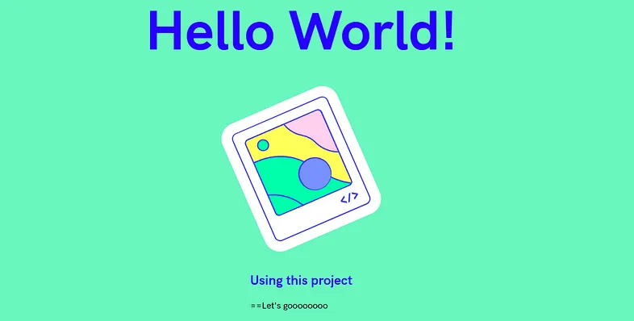
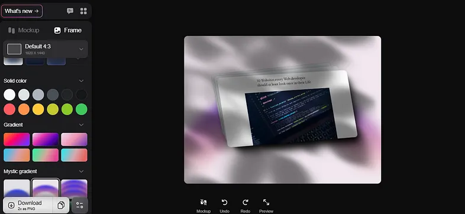
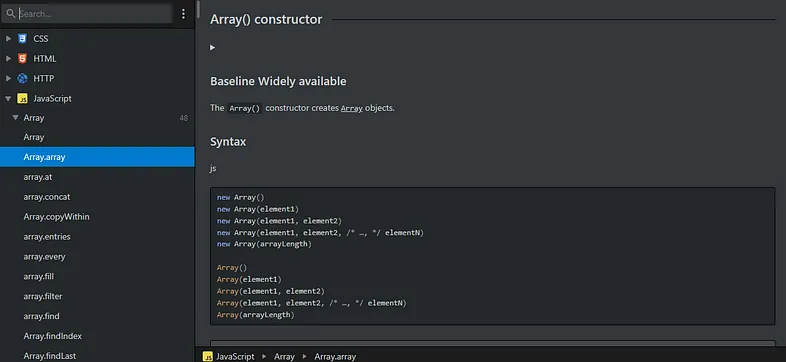
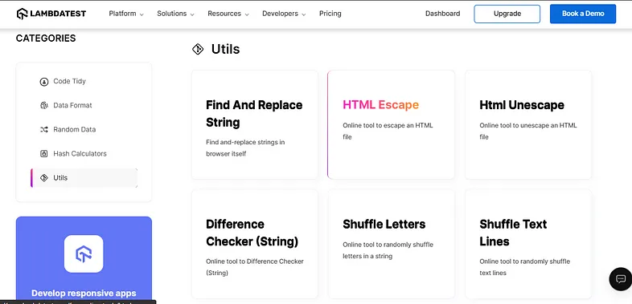
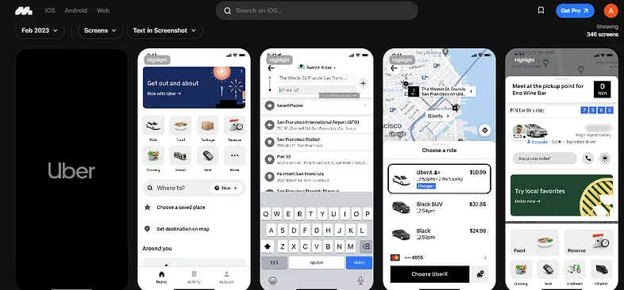
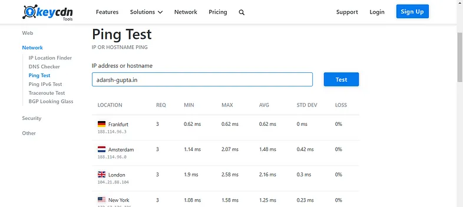
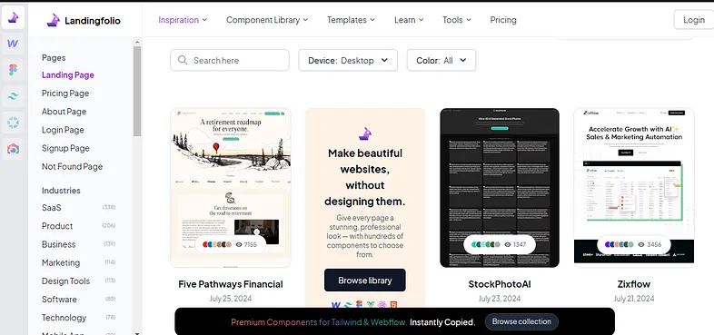
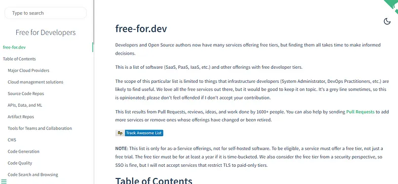
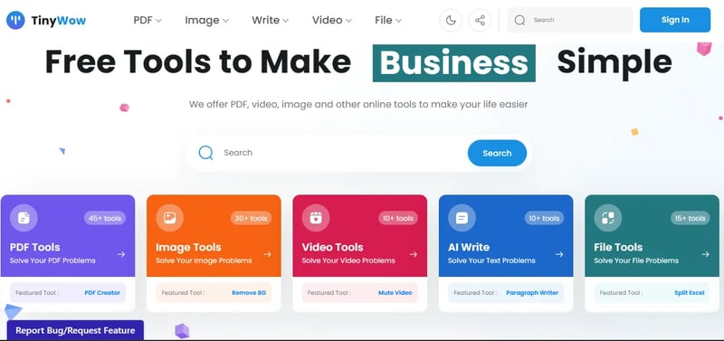

# UI verse

UI verse is massive library with 100s of design elements that you can just copy paste into your website. It is one of the largest Open source UI library.

Link <https://uiverse.io/checkboxes>

# Glitch

Glitch helps to create your next web project in browser with no setup and instant deployment.

Link: <https://glitch.com>

# Shots.so

Create beautifully designed image backgrounds for your images. With over 100’s of prebuilt as well as customizable templates, you can make your images 10X better

Link: <https://www.shots.so>

# Dev Docs

What if you have a documentation which have documented almost everything you need? DevDocs combines multiple API documentations in a fast, organized, and searchable interface.

Link: <https://devdocs.io/>

# LambdaTest Free Online Tools

A collection of free online tools, utilities, and libraries that will help developers, testers, designers, in their day to day tasks

Link: <https://www.lambdatest.com/free-online-tools>

# Mobbin

The world’s largest mobile and web design library. Save hours of UI & UX research with our library of 300,000+ screens from the world’s best designed apps.

Link: <http://Mobbin.com>

# Ping Test

You can ping any IP address or hostname from 10 locations in parallel.

Link: <https://tools.keycdn.com/ping>

# LandingFolio

Most developers are not designers and this website is the best choice for developers to get inspiration

Link: <https://www.landingfolio.com/>

# Free for Dev

A compilation of free software and services, covering everything from SaaS to developer tools, APIs, and cloud platforms.

Link: <https://free-for.dev/#/>

# Tiny Wow

We always look for a free alternative and this website is a goldmine. Discover a wide range of free tools and services.

Link: <https://tinywow.com/>

