# Table of contents

- [Table of contents](#table-of-contents)
  - [CMS introduction](#cms-introduction)
  - [CMS interface](#cms-interface)
  - [CMS login](#cms-login)
  - [CMS (devices) tablet](#cms-devices-tablet)
    - [Overview of page tablet (devices) list features](#overview-of-page-tablet-devices-list-features)
    - [Main features of a tablet (device)](#main-features-of-a-tablet-device)
  - [CMS Polar sensors](#cms-polar-sensors)
  - [CMS session](#cms-session)
  - [How to add a Polar sensor to tablet](#how-to-add-a-polar-sensor-to-tablet)
    - [Step 1: Login gym owner account to tablet](#step-1-login-gym-owner-account-to-tablet)
    - [Step 2: Turn on Polar sensor, check Polar UUID](#step-2-turn-on-polar-sensor-check-polar-uuid)
    - [Step 3: Create Polar sensor for a tablet on CMS](#step-3-create-polar-sensor-for-a-tablet-on-cms)
    - [Step 3: Test connection giữa Polar sensor and Fulfit For Gym app](#step-3-test-connection-giữa-polar-sensor-and-fulfit-for-gym-app)
  - [Using Fulfit For Gym service for the first time](#using-fulfit-for-gym-service-for-the-first-time)
    - [Step 1](#step-1)
    - [Step 2](#step-2)
    - [Step 3](#step-3)
    - [Step 4](#step-4)
    - [Step 5](#step-5)

## CMS introduction

A Content Management System (CMS) is an online application that allows individuals to manage the content on their websites, without the need to have prior knowledge of coding or design principles. The CMS allows individuals to create, edit, and delete content from their websites and preview any changes before publishing to the live website.

## CMS interface

The default interface for gym owners will include:

- Gym owner login / forgot password page

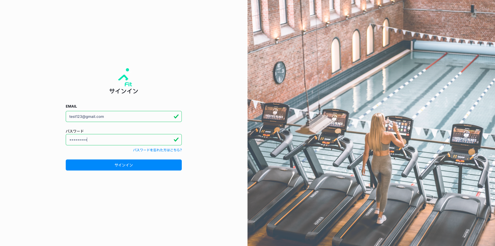

- Manage tablet (devices) list

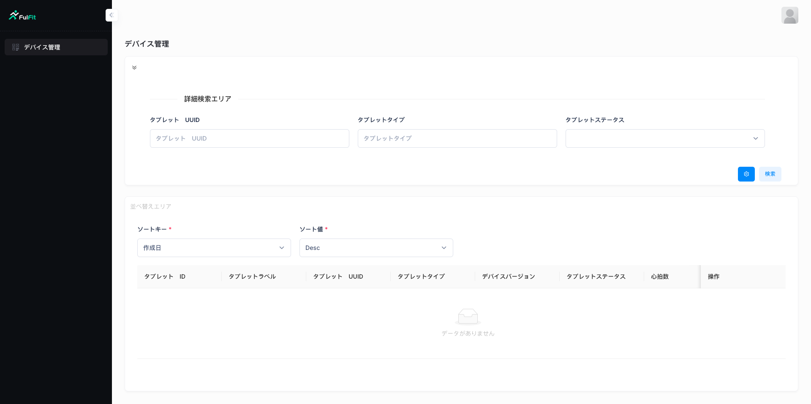

## CMS login

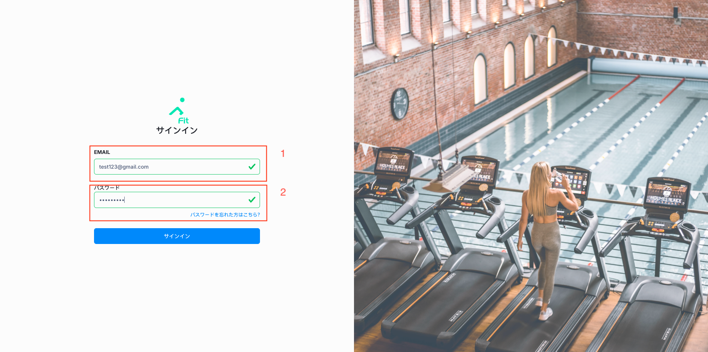

1. Email account provided by Airstage.
2. Password provided by Airstage.

If you do not have an account please contact us.

## CMS (devices) tablet

### Overview of page tablet (devices) list features

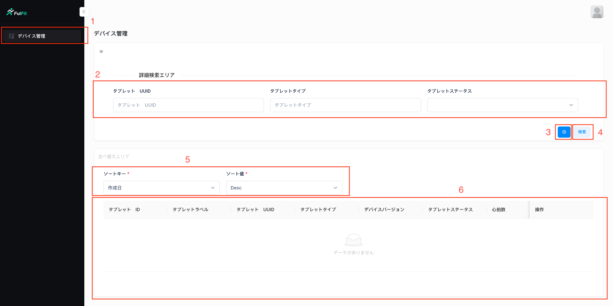

1. Tablet (devices) list item in sidebar.
2. Advance search for tablet (devices) list table.
3. Advance custom column table. Can change the position or add, delete custom columns displayed in the tablet (device) table.
4. Button refesh tablet (devices) table with conditional.
5. Sort order by one custom column in tablet (devices) table.
6. Tablet (devices) table with custom column.

Regarding the admin page, there will be no feature to add any (device) tablet to gym owner account.
> **When a (device) tablet has downloaded the Fulfit For Gym application and logged in with the gym owner's account for the first time, the system will automatically add a new tablet (device) to the gym owner's admin page.**
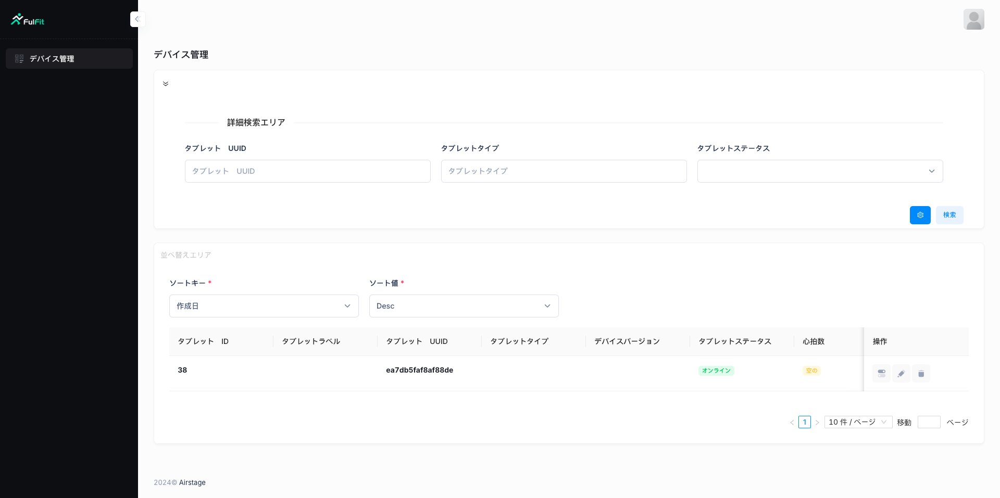

### Main features of a tablet (device)

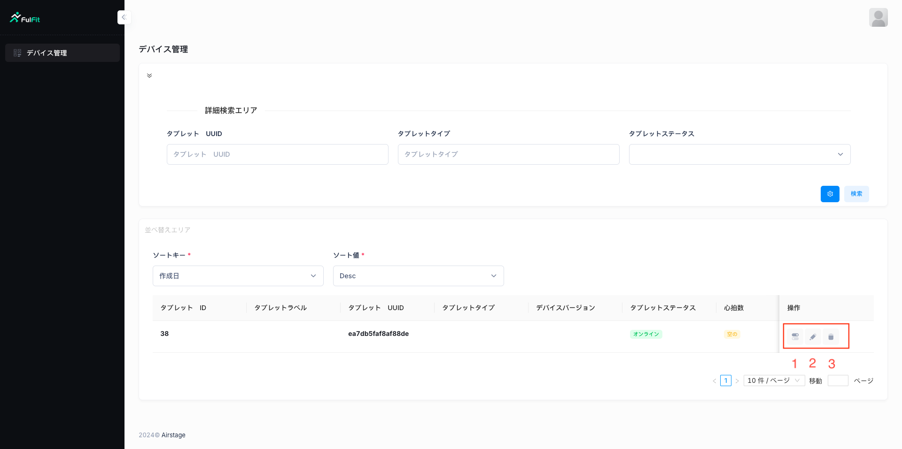

Each tablet in the table has an action item, there will be buttons including the following features:

1. List Polar sensors table
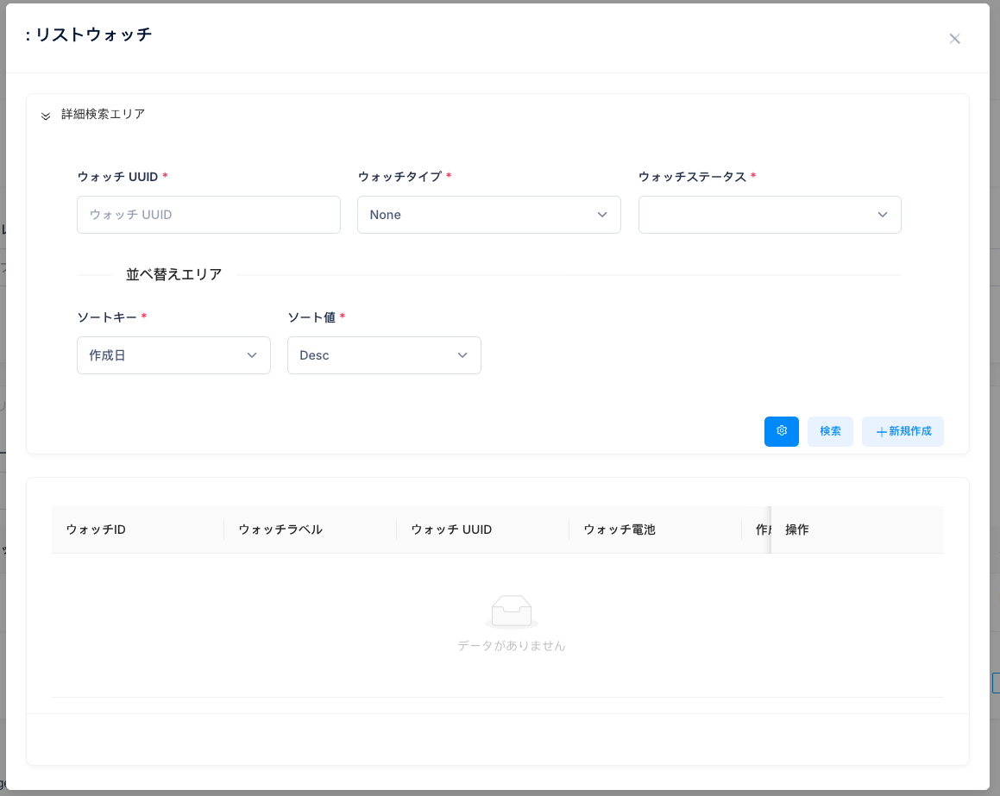
2. Edit and detail of tablet
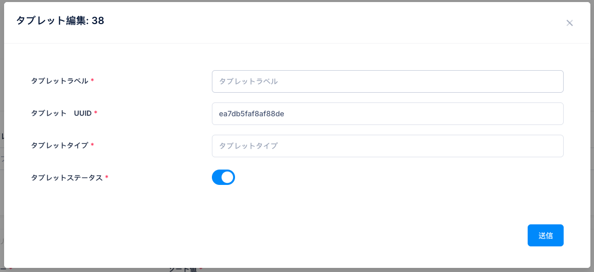
3. Delete tablet
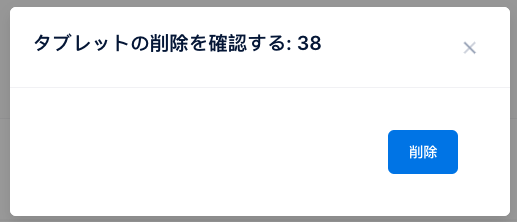

## CMS Polar sensors

1. List Polar sensors table

1.1. If Polar sensors tablet had data
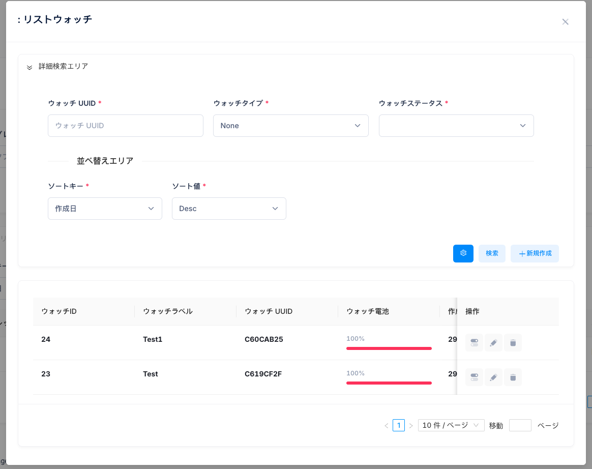

2. Create a Polar sensor for a tablet
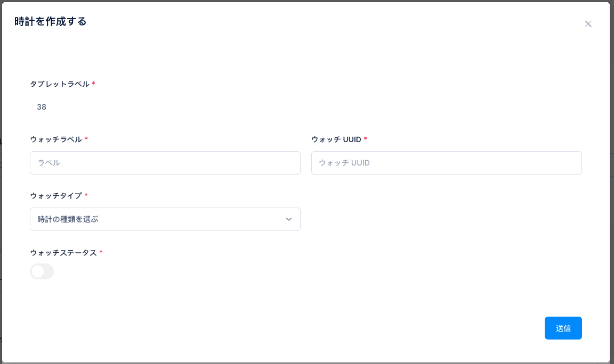

3. Edit a Polar sensor for a tablet
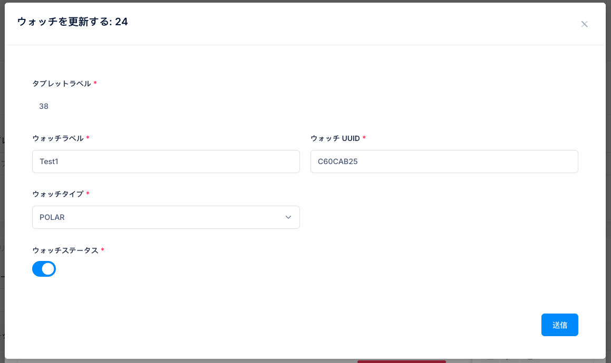

4. Delete a Polar sensor for a tablet
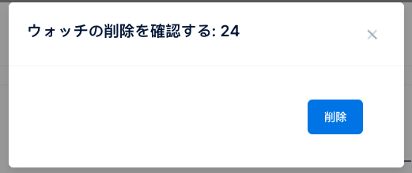

## CMS session

Polar histories session of Polar sensor
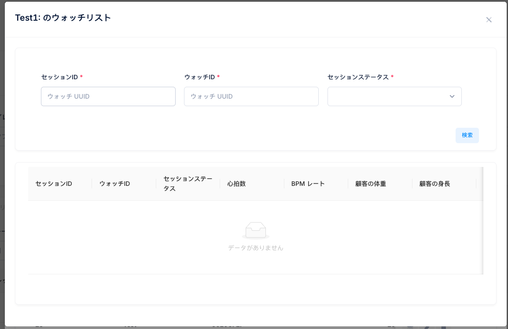

## How to add a Polar sensor to tablet

### Step 1: Login gym owner account to tablet

First you need login gym owner account to tablet for tablet to be initialized in the system.

### Step 2: Turn on Polar sensor, check Polar UUID

### Step 3: Create Polar sensor for a tablet on CMS

### Step 3: Test connection giữa Polar sensor and Fulfit For Gym app

## Using Fulfit For Gym service for the first time

### Step 1

### Step 2

### Step 3

### Step 4

### Step 5
