# Table of contents

- [Table of contents](#table-of-contents)
  - [CMS introduction](#cms-introduction)
  - [CMS interface](#cms-interface)
  - [CMS login](#cms-login)
  - [CMS (devices) tablet](#cms-devices-tablet)
    - [Overview of page tablet (devices) list features](#overview-of-page-tablet-devices-list-features)
    - [Main features of a tablet (device)](#main-features-of-a-tablet-device)
  - [CMS Polar sensors](#cms-polar-sensors)
  - [CMS session](#cms-session)
  - [Using Fulfit For Gym service for the first time](#using-fulfit-for-gym-service-for-the-first-time)
    - [Step 1: Prepare the environment and necessary equipment](#step-1-prepare-the-environment-and-necessary-equipment)
    - [Step 2: Login gym owner account to tablet](#step-2-login-gym-owner-account-to-tablet)
    - [Step 3: Turn on Polar sensor, check Polar UUID](#step-3-turn-on-polar-sensor-check-polar-uuid)
    - [Step 4: Create Polar sensor for a tablet on CMS](#step-4-create-polar-sensor-for-a-tablet-on-cms)
    - [Step 5: Test connection between Polar sensor and Fulfit For Gym app](#step-5-test-connection-between-polar-sensor-and-fulfit-for-gym-app)

## CMS introduction

A Content Management System (CMS) is an online application that allows individuals to manage the content on their websites, without the need to have prior knowledge of coding or design principles. The CMS allows individuals to create, edit, and delete content from their websites and preview any changes before publishing to the live website.

## CMS interface

The default interface for gym owners will include:

- Gym owner login / forgot password page

- Manage tablet (devices) list

## CMS login

1. Email account provided by Airstage.
2. Password provided by Airstage.

If you do not have an account please contact us.

## CMS (devices) tablet

### Overview of page tablet (devices) list features

1. Tablet (devices) list item in sidebar.
2. Advance search for tablet (devices) list table.
3. Advance custom column table. Can change the position or add, delete custom columns displayed in the tablet (device) table.
4. Button refesh tablet (devices) table with conditional.
5. Sort order by one custom column in tablet (devices) table.
6. Tablet (devices) table with custom column.

Regarding the admin page, there will be no feature to add any (device) tablet to gym owner account.
> **When a (device) tablet has downloaded the Fulfit For Gym application and logged in with the gym owner's account for the first time, the system will automatically add a new tablet (device) to the gym owner's admin page.**

### Main features of a tablet (device)

Each tablet in the table has an action item, there will be buttons including the following features:

1. List Polar sensors table

This page will display the list of Polars you have added for the specified tablet object.
1. Edit and detail of tablet

1. Delete tablet

## CMS Polar sensors

1. List Polar sensors table

This page will display the list of Polars you have added for the specified tablet object.

    1.1. If Polar sensors tablet had data

2. Create a Polar sensor for a tablet

3. Edit a Polar sensor for a tablet

4. Delete a Polar sensor for a tablet

## CMS session

Polar histories session of Polar sensor

## Using Fulfit For Gym service for the first time

### Step 1: Prepare the environment and necessary equipment

- Prepare tablet and Polar sensors.
- Download the Fulfit For Gym app to your tablet at: <https://play.google.com/store/apps/details?id=jp.fulfit.gym>
- Admin account to manage the list of equipment and polars in the gym on the website: <https://cms.gym.fulfit.jp/>

**If you do not have an account, please contact us.**

### Step 2: Login gym owner account to tablet

First, you need to log in to the gym owner account on the Fulfit For Gym app on a tablet for the tablet to be initialized in the system.

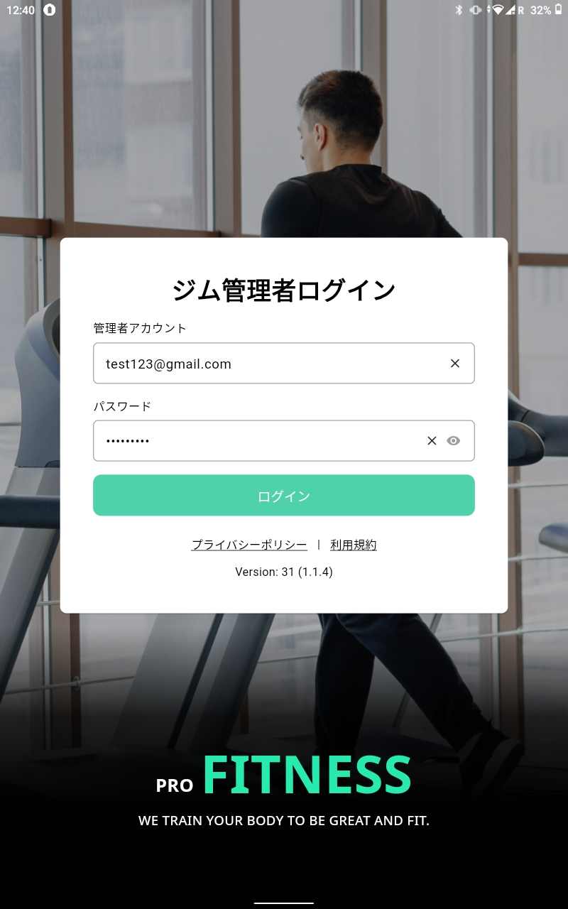

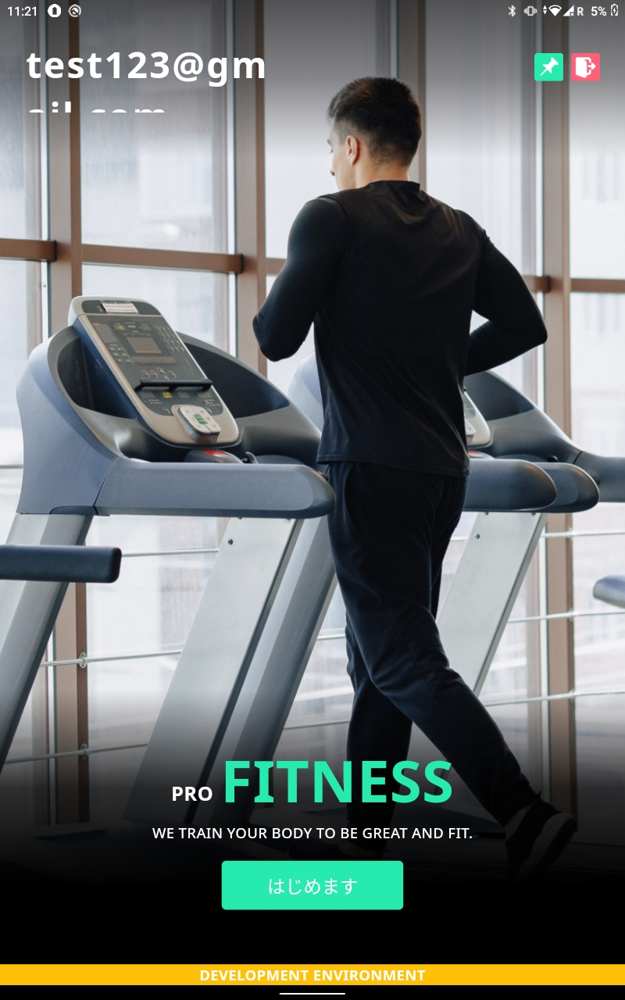

After successfully logging in to the Fulfit For Gym app on your tablet, a device will appear in the device list in the CMS.

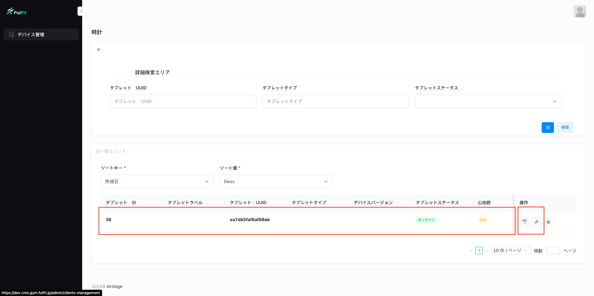

You can change tablet information and set up unique names for tablets:

- Tablet Nickname
- Tablet UUID (generate from tablet)
- Tablet type
- Status

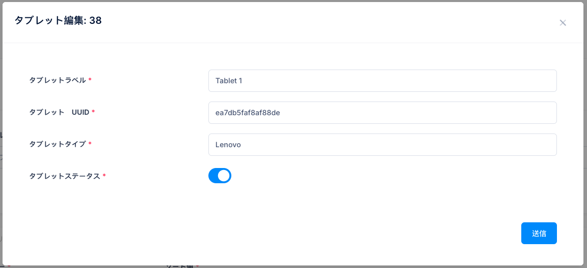

### Step 3: Turn on Polar sensor, check Polar UUID

Second, you need to turn on the Polar and check the small UUID located on the Polar.

For example UUID: C619xxxx

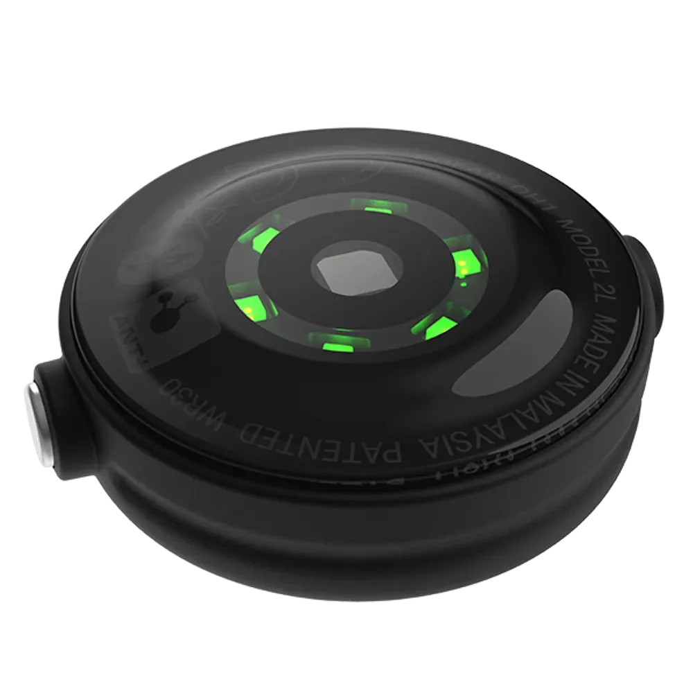

### Step 4: Create Polar sensor for a tablet on CMS

On the screen add polar list of the tablet. You can add new Polar by clicking on the button in the picture

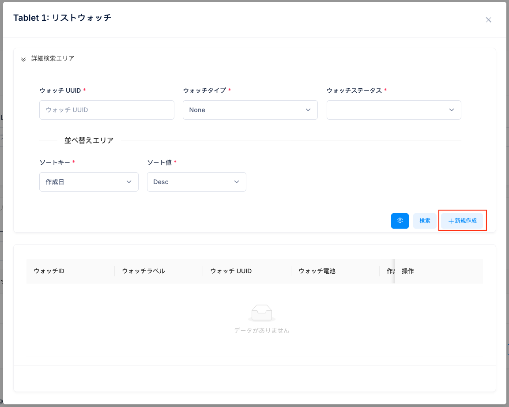

When you click on the button. A modal will open, fill in the polar information such as:

- Polar Nickname
- Polar UUID
- Device Type -> select Polar
- Status

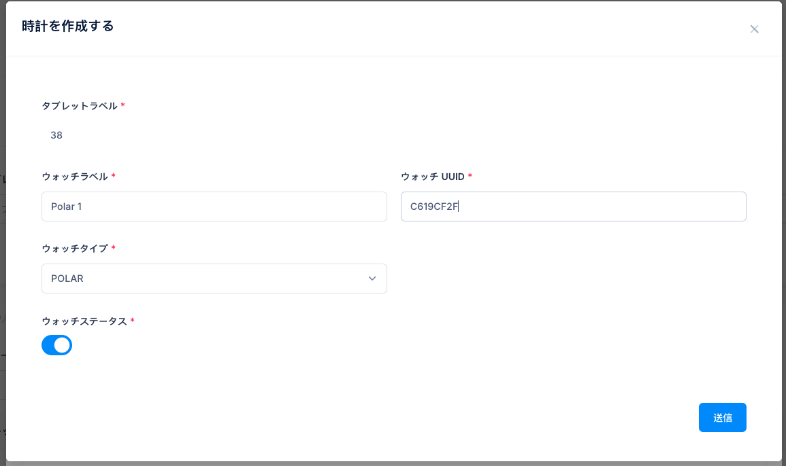

After creating a new Polar, the device's polar list will be updated.

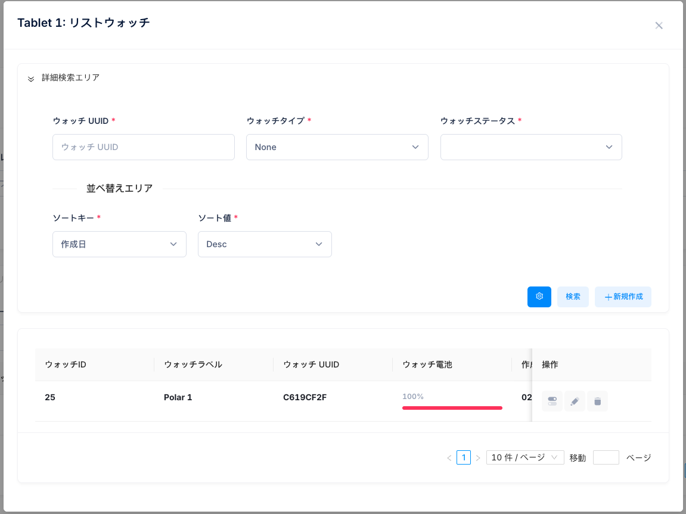

### Step 5: Test connection between Polar sensor and Fulfit For Gym app

After successfully logging in and on the waiting screen in Fulfit For Gym app. Press the button and select continue with guest.

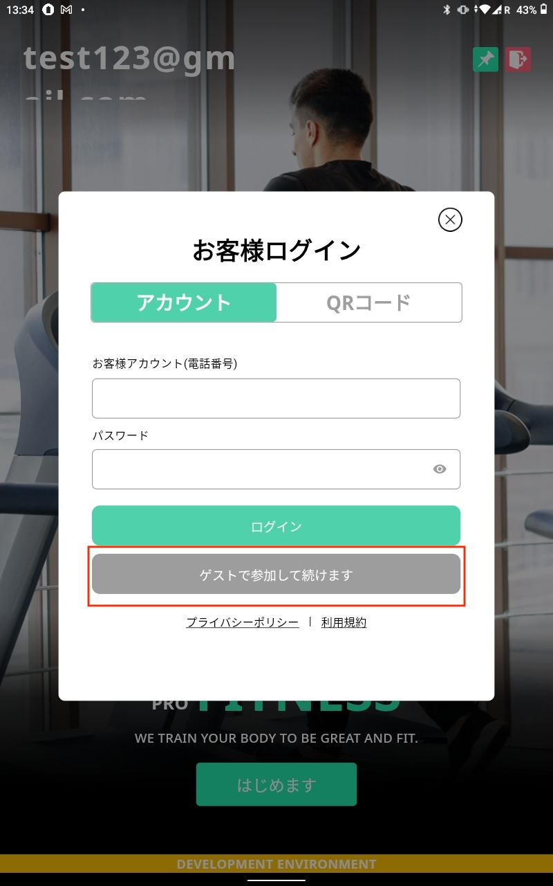

Select gender of guest

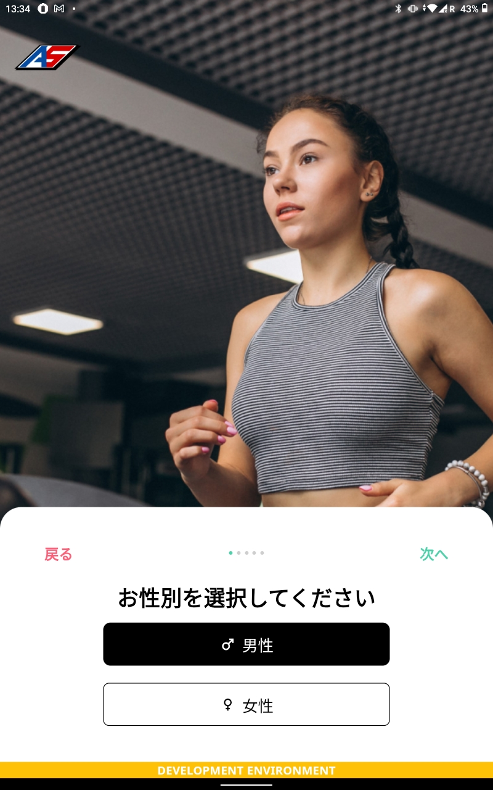

Input age of guest

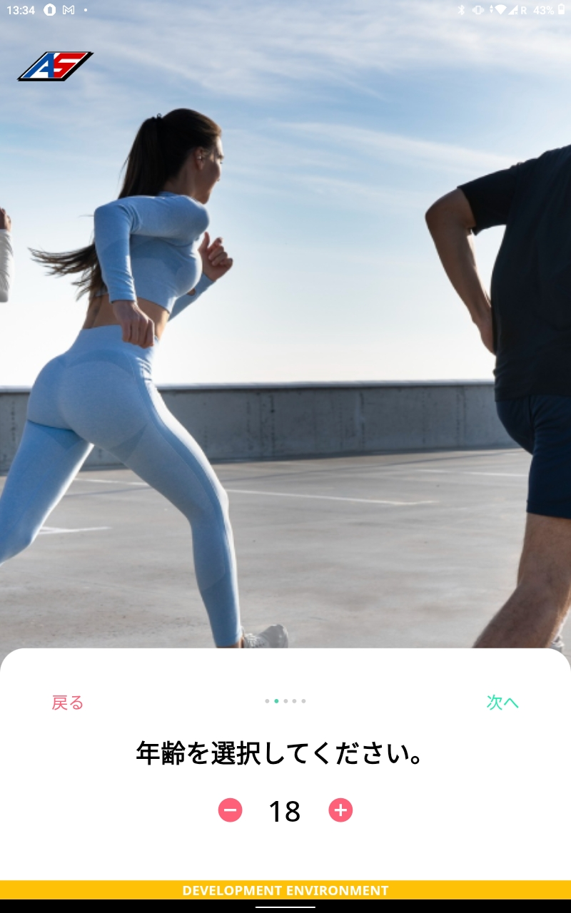

Input weight of guest

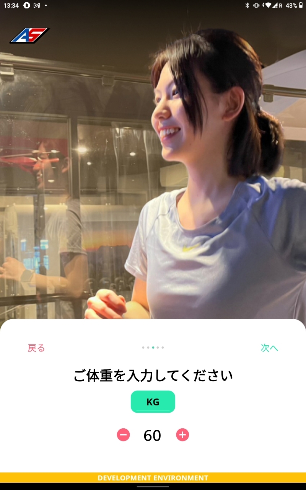

Input height of guest

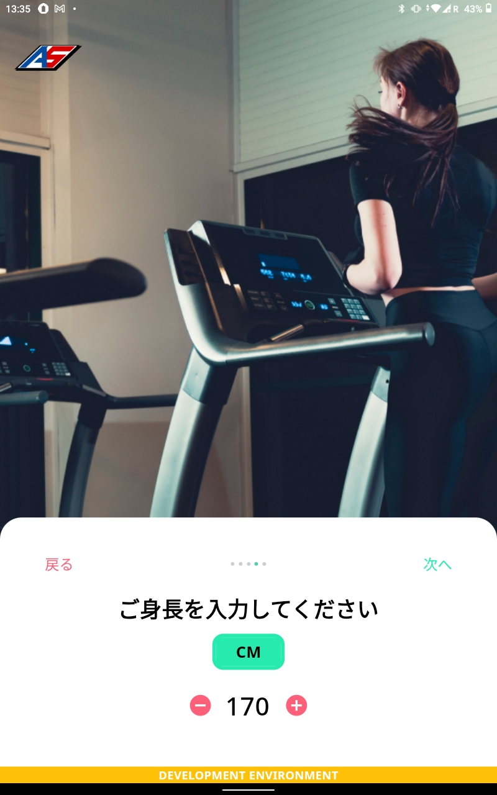

Select Polar just add on CMS

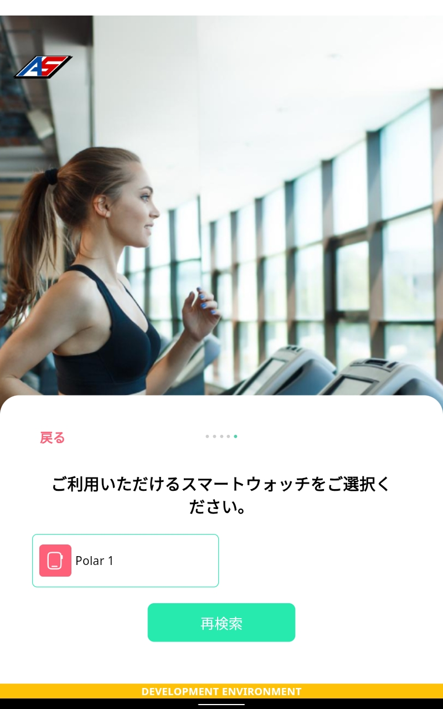

> **Make sure you have enabled permission for:**

- Location
- Nearby device
- Bluetooth

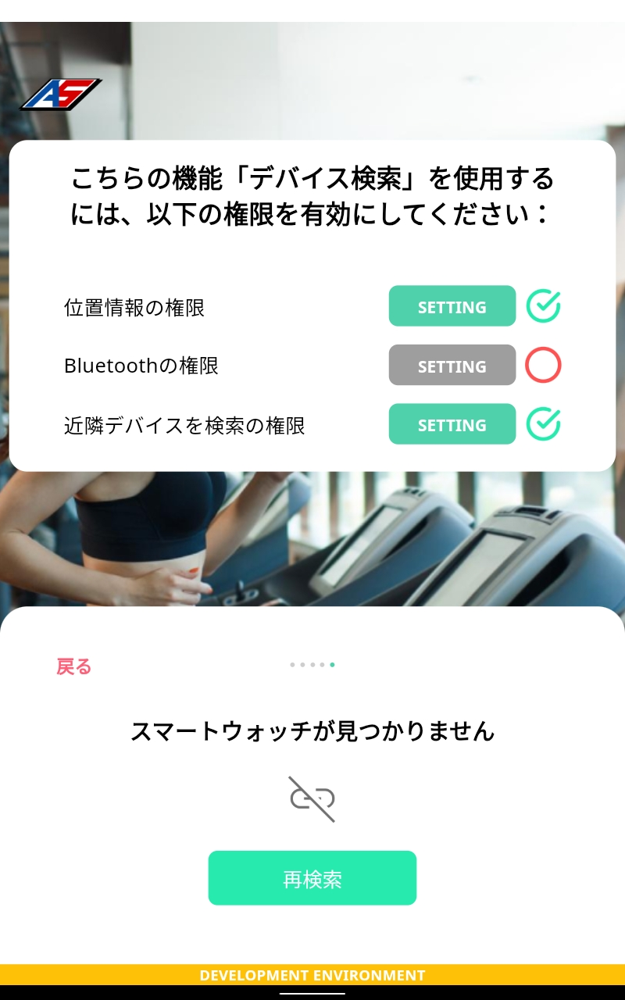

Last step, take resting heart rate from polar device and start a workout

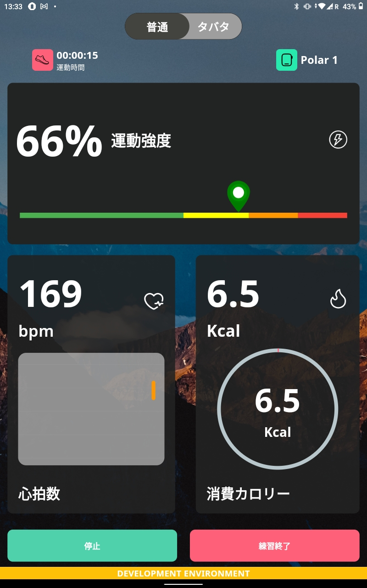
